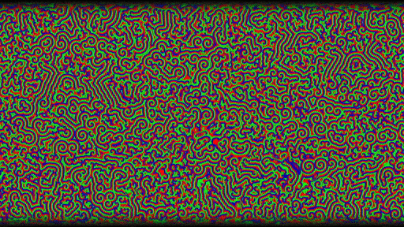

# BZSim

Simulation of a [Belousov-Zhabotinsky reaction](https://en.wikipedia.org/wiki/Belousov%E2%80%93Zhabotinsky_reaction) running at 60 FPS.



Based on paper by [Turner, A. "A simple model of the Belousov-Zhabotinsky reaction from first principles" (2009)](https://discovery.ucl.ac.uk/id/eprint/17241/).

### Contents

- `src/`
    - [`bzsim_naive.c`](./src/bzsim_naive.c) - naive implementation.
    - [`bzsim_simd.c`](./src/bzsim_simd.c) - optimized implementation using AVX512 SIMD intrinsics.
    - [`bzsim_simd_unrolled.c`](./src/bzsim_simd_unrolled.c) - optimized implementation using AVX512 SIMD intrinsics with partial loop unrolling.
    - [`bzsim_simd_unrolled_parallel.c`](./src/bzsim_simd_unrolled_parallel.c) - optimized multithreaded implementation using AVX512 SIMD intrinsics with partial loop unrolling.
    - [`main_sdl2.c`](./src/main_sdl2.c)

### Requirements

- Linux
- GCC 14+
- SDL2

### Build & Run

```bash
./build.sh
```

### Usage

- **Space**: pause/resume simulation
- **Right Arrow**: advance simulation frame-by-frame
- **Escape**: exit

### TODO

- Compile to WASM
- GPU rendering
- Port to Win & Mac
- ...
